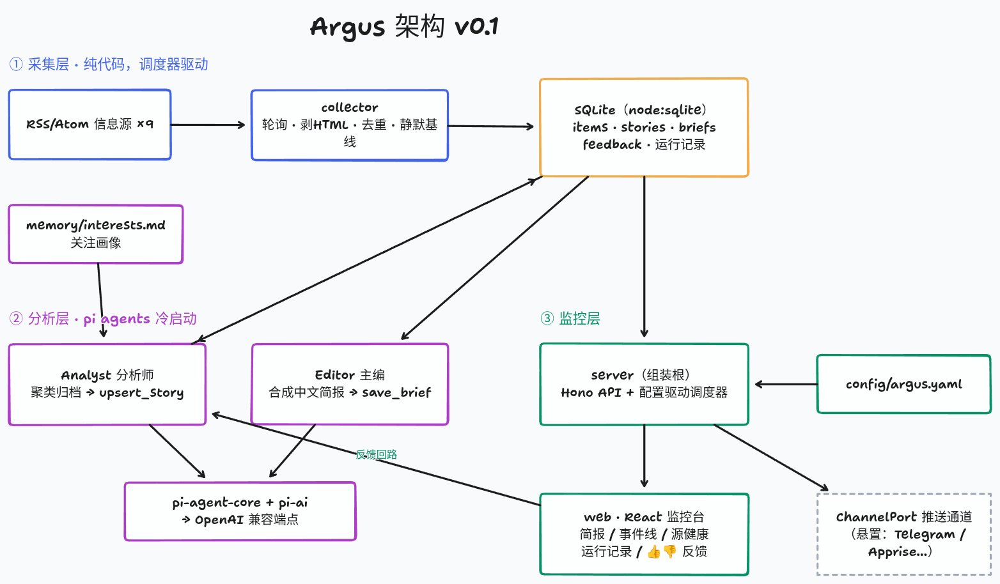

# Argus

<p align="center"><strong>◉ 基于 <a href="https://pi.dev">pi</a> 的个人信息监控与情报合成系统</strong></p>

Argus 不是 RSS 过滤器，而是一条**以事件为中心的信息处理管线**：定时采集 →
模型聚类成事件 → 定期合成中文简报，配一个可观测的监控台。

- **以事件为中心**：跨源的碎片条目被 Analyst 聚合成有生命周期的事件（Story），给你的是合成后的叙事，不是零散链接
- **代码做确定性的事，模型做判断性的事**：轮询、抓取、去重、入库是纯代码；相关性、聚类、重要度、写作交给模型
- **记忆与反馈**：关注画像持久化，👍👎 反馈会进入 Analyst 下一轮的判断依据
- **监控仪表盘**：Web 界面查看简报、事件时间线、信息源健康、agent 运行记录

> **关于"agent"这个词。** Argus 里的 Analyst 和 Editor 是**冷启动、单工具、
> 一轮即止**的模型调用：上下文 100% 由代码预先组装，两个工具都是写操作
> （`upsert_story` / `save_brief`），没有任何读工具，也不能决定自己何时运行、
> 看什么材料、要不要深挖。
>
> 按通常的标准，它们**不是自主 agent**，而是管线里带结构化输出的判断环节。
> 这是当前阶段的刻意取舍——对"采集→聚类→写简报"这个闭环，确定性管线比
> 自主 agent 更便宜、更可复现、更好调试。真正需要自主性的部分（深挖调查、
> 源发现、自调优）在路线图的 M3/M4，尚未实现。详见 [DESIGN.md](DESIGN.md)。

## 工作方式

```
RSS/Atom 信息源 ──采集层（纯代码，定时）──► SQLite
                                            │ 新条目批次
                 Analyst（pi agent）────────┤ 聚类归档 → 事件（Story）
                 Editor （pi agent）────────┤ 合成中文简报
                                            ▼
                 Web 监控台 ◄── Hono API ── 简报 / 事件线 / 源健康 / 运行记录
```

分析层基于 [@earendil-works/pi-agent-core](https://github.com/badlogic/pi-mono) 构建：每轮冷启动、上下文由代码从数据库组装、注册的工具是唯一副作用出口，行为可复现。

## 快速开始

要求 Node ≥ 22（使用内置 node:sqlite，无原生编译依赖）。

```bash
git clone https://github.com/1797127235/argus.git
cd argus
npm install

# 配置模型（OpenAI 兼容端点）
cp .env.example .env   # 填入 ARGUS_AI_BASE_URL / ARGUS_AI_API_KEY / ARGUS_AI_MODEL

# 首轮采集（首次抓取只建立静默基线，不分析历史存量）
npm run argus -- collect

# 完整跑一轮：采集 → 分析 → 简报
npm run argus -- run

# 常驻运行：调度器 + Web 监控台（http://127.0.0.1:8787）
npm run build:web
npm run serve
```

## 命令

| 命令 | 作用 |
|---|---|
| `npm run argus -- collect` | 采集一轮全部信息源 |
| `npm run argus -- analyze` | Analyst 消化未分析条目，聚类成事件 |
| `npm run argus -- brief` | Editor 生成一期简报（同时落盘到 `data/reports/`） |
| `npm run argus -- run` | 完整跑一轮 |
| `npm run argus -- status` | 查看状态 |
| `npm run serve` | 常驻：调度器 + Web 监控台 |
| `npm run dev:web` | 前端开发模式（需另开 `npm run serve`） |

## 配置

- **`config/argus.yaml`** —— 信息源、镜像组、调度（简报时刻、轮询间隔）、分析参数、Web 端口
- **`memory/interests.md`** —— 关注画像，Analyst 判断相关性的唯一依据，随时可改
- **`.env`** —— 模型端点与密钥（不入库）；`ARGUS_ANALYST_MODEL` / `ARGUS_EDITOR_MODEL` 可按角色分层配模型

### 镜像组：让多个源共用一份备用地址

一堆源走同一个自建实例（比如所有 X 源都经自建 RSSHub）时，实例挂掉会让它们
同时哑掉。把 url 写成 `"{组名}/路径"`，加载时展开为组内各地址，第一个作主
地址、其余作备用，抓取时依次重试：

```yaml
mirrors:
  rsshub:
    - https://rsshub.your-host.com      # 主地址
    - https://rsshub-backup.your-host.com  # 主地址失败时自动回退

sources:
  - id: x-karpathy
    name: X @karpathy
    type: rss
    url: "{rsshub}/twitter/user/karpathy"   # 展开为上面两个地址
    enabled: true
```

换实例只改 `mirrors` 一处。也可以给单个源直接写 `fallbackUrls: [...]`。

### 积压上限：防 backlog 突增

`analysis.maxPendingPerSource`（默认 50）限制单个源能积压多少条待分析条目，
超出的按时间从旧到新静默丢弃。防的是这几种情况：源换了 url、久禁后重新启用、
源批量回填历史——整批存量会一次性涌进 Analyst，把真正的新消息挤掉。
设为 `0` 关闭该限制。

> 首次抓取的源走的是另一套机制：**静默基线**，条目入库但直接标记已分析，
> 存量历史完全不进入分析。

## 架构



（源文件 [docs/architecture.tldr](docs/architecture.tldr)，可用 [tldraw](https://www.tldraw.com/) 打开编辑）

六个解耦的 workspace 包，依赖单向流动：

```
core       纯领域类型 + 端口接口（零依赖）
storage    StoragePort 的 SQLite 实现（node:sqlite）
collector  RSS 采集 → 规范化 → 去重入库（只依赖 core）
agents     Analyst / Editor（只依赖 core + pi）
server     组装根：CLI、调度器、Hono API、静态托管
web        React 监控台（只与 HTTP API 交互）
```

推送通道（Telegram/Apprise 等）当前悬置，`core` 中已定义 `ChannelPort` 接口，实现后即可接入而不改核心管线。

- 设计取舍与路线图见 [DESIGN.md](DESIGN.md)
- 包边界、数据模型、API、扩展方式见 [docs/architecture.md](docs/architecture.md)

## License

MIT
